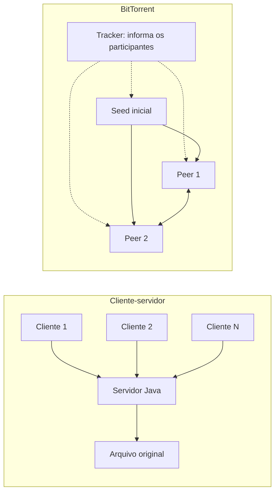

# Sistemas Distribuídos · Atividade 01 — Unidade 2

**Aluno:** Breno Thiago Argemiro Santos

**Universidade Federal de Sergipe**

Avaliação de desempenho de transferência de arquivos em três arquiteturas cliente-servidor e em **P2P com BitTorrent**. Java 21 implementa os servidores, clientes, tracker, controle dos experimentos e geração do relatório PDF. O Transmission executa o protocolo BitTorrent.

## Arquiteturas



| Modalidade | Atendimento |
|---|---|
| Sequencial | Um download por vez; os demais aguardam |
| Paralelo | Uma thread por conexão |
| Pool | No máximo N downloads ativos; padrão N = 2 |
| BitTorrent | Seed e peers distribuem peças do arquivo entre si |

Nas três modalidades Java, o servidor envia o arquivo por TCP. A política de execução muda, mas o protocolo e o limite agregado de upload são os mesmos. Esperar na fila faz parte do tempo do cliente.

No BitTorrent, o arquivo `.torrent` descreve peças de 256 KiB e seus hashes. O tracker informa os endereços dos participantes, **sem transportar o arquivo**. Peers recebem peças, verificam seu conteúdo e podem enviá-las aos demais. Cada participante continua compartilhando até todos concluírem.

## Executar

Requisitos: Docker Engine ou Docker Desktop com Compose v2, acesso à internet para construir as imagens e espaço livre para aproximadamente 6 GB de dados temporários. Java e Maven são usados dentro do Docker. O Docker Desktop precisa estar configurado para containers Linux.

Abra o terminal **na pasta deste projeto**:

Se estiver baixando o projeto pela primeira vez:

```bash
git clone https://github.com/Breno-Thiago/sistemas-distribuidos-atividade-1-unidade-2.git
cd sistemas-distribuidos-atividade-1-unidade-2
```

Depois, execute:

```bash
docker compose up -d --build
docker compose run --rm executor testar
docker compose run --rm executor benchmark --perfil completo
docker compose run --rm executor relatorio
```

A primeira construção executa os testes unitários e baixa as dependências. O executor aguarda os serviços ficarem acessíveis. A matriz completa movimenta aproximadamente 100 GB de conteúdo **na rede local do Docker**, além do tráfego do protocolo, e pode levar mais de uma hora. Não interrompa apenas porque uma execução de 500 MB demorou.

Para acompanhar:

```bash
docker compose logs -f servidor tracker
docker compose ps
```

Para uma demonstração curta, execute o perfil rápido (5 MB, 1 e 2 clientes, uma repetição, quatro modalidades):

```bash
docker compose run --rm executor benchmark --perfil rapido
```

O perfil rápido produz CSVs, mas o PDF final exige a matriz completa. Ao executar o perfil completo depois, as condições compatíveis já medidas são reaproveitadas.

Para executar o fluxo inteiro com um comando no Linux ou no Bash:

```bash
bash scripts/experimento-completo.sh
```

Esse roteiro constrói, coleta informações do host, testa, mede e gera o PDF. No Windows e macOS, os comandos `docker compose` acima são suficientes; os scripts `.sh` exigem Bash. A captura automática `host.txt` utiliza ferramentas do Linux.

## Testes

```bash
bash scripts/testar.sh
# Ou, em qualquer sistema com Docker:
docker compose up -d --build
docker compose run --rm executor testar
```

| Verificação | Como é conferida |
|---|---|
| Concorrência | Quatro clientes: pico 1, 4 e N no servidor |
| Conteúdo | Tamanho e SHA-256 iguais ao original |
| BitTorrent real | Seed a 5 MB/s somente neste teste; upload positivo dos peers e conexões com recebimento de outro peer |
| Última peça incompleta | Arquivos com tamanhos que não são múltiplos de 256 KiB |
| Limpeza | Downloads removidos e tracker sem enxames depois do teste |
| Retomada | Quatro transferências interrompidas são canceladas, sem parciais, antes de novos downloads |
| Falhas | Testes unitários de transferência interrompida, timeout e conteúdo corrompido |
| Estatísticas | Mínimo, média e máximo confrontados com amostras conhecidas |
| Limite agregado | Duas threads compartilham a mesma capacidade de upload |

Falhas fazem o programa encerrar com código diferente de zero. O teste de integração registra as etapas e a evidência de P2P em `resultados/testes.json`. Os nove testes unitários são executados pelo Maven na construção; uma falha impede a criação da imagem.

## Resultados e relatório

As medições publicadas já estão completas. O benchmark preserva esses registros; para medir novamente, siga a seção **Retomar, repetir e encerrar**.

Exemplo: **500 MB, oito clientes, 24 tempos individuais nas três repetições**, em segundos:

| Modalidade | Mínimo | Média | Máximo |
|---|---:|---:|---:|
| Sequencial | 28,902 | 125,317 | 223,434 |
| Paralelo | 160,022 | 160,119 | 160,303 |
| Pool (N = 2) | 36,371 | 101,206 | 163,804 |
| BitTorrent | 47,392 | 48,464 | 49,256 |

Esses números descrevem o ambiente local documentado; os outros tamanhos e quantidades de clientes estão nas tabelas e no PDF.

- [Relatório PDF](relatorio/relatorio.pdf): metodologia, ambiente, tabelas, gráficos, discussão e apêndice.
- [Resumo](resultados/resumo.csv): mínimo, média e máximo dos downloads por condição, reunindo três repetições.
- [Execuções](resultados/execucoes.csv): estatísticas de cada execução, makespan e upload de seed/peers.
- [Downloads](resultados/downloads.csv): tempo individual, verificação, desvio de início e hash.
- Registros JSON por execução: evidência e retomada. `ambiente.json` registra versões e configuração; `host.txt` complementa o ambiente físico.
- `artefato-medido.txt` identifica, em ordem, o commit das medições, o SHA-256 do JAR em execução e a imagem Transmission utilizada. As revisões posteriores melhoram retomada, limpeza e apresentação do relatório.

Matriz: **5, 50 e 500 MB × 1, 2, 4 e 8 clientes × quatro modalidades × três repetições**. São 48 condições, 144 execuções e 540 downloads. MB é decimal: 1 MB = 1.000.000 bytes. Servidor e seed ficam fora da contagem de clientes.

O executor usa `System.nanoTime()` para medir, por cliente, desde o comando de início até observar a conclusão. Os comandos são enviados em paralelo e os estados são consultados a cada 100 ms, acrescidos do custo das requisições. A descoberta de peers e a espera na fila são incluídas; preparação de arquivos, containers e torrents fica fora. A verificação SHA-256 adicional é registrada separadamente.

O **makespan** mede até todos concluírem; não é a média dos tempos individuais. Os clientes que terminam cedo continuam compartilhando no BitTorrent. Há aquecimento nas quatro modalidades e ordem embaralhada com semente fixa. O cache do sistema operacional não é eliminado.

O upload nominal é **25 MB/s por nó**, agregado entre conexões. Java usa um limitador compartilhado; Transmission usa seu próprio limitador de sessão de 25.000 kB/s decimais. Janelas e rajadas podem diferir. O servidor cliente-servidor concentra a capacidade de envio; BitTorrent pode somar a contribuição dos peers.

**Limitação do experimento:** todos os nós são containers no mesmo computador, compartilhando hardware e kernel. Os resultados descrevem esse ambiente e não devem ser apresentados como medições entre máquinas físicas distintas. A interpretação do requisito “de uma máquina para as demais” deve ser confirmada com o professor.

## Retomar, repetir e encerrar

Execuções concluídas são salvas individualmente. Para retomar após uma falha:

```bash
docker compose run --rm executor benchmark --perfil completo
```

Condições já registradas e compatíveis são preservadas. Um arquivo de trava impede dois executores de testar/medir simultaneamente. Falhas são registradas em `resultados/falhas.jsonl`; elas não viram amostras válidas.

Para **um novo conjunto de medições**, encerre os executores, renomeie a pasta `resultados` para preservar os dados e crie outra pasta vazia com esse nome. O PDF existente só é substituído ao gerar um novo relatório. Mudanças de N ou taxa exigem resultados separados:

```bash
# Exemplo no Bash; configuração diferente do experimento padrão
POOL_N=4 UPLOAD_BPS=10000000 docker compose run --rm executor benchmark --perfil completo
```

Ao alterar N ou a taxa, use os mesmos valores de configuração nos testes e na geração do PDF.

Encerrar preservando resultados, PDF e volume:

```bash
docker compose down
```

Remover também os arquivos temporários e originais gerados no volume:

```bash
docker compose down -v
```

CSVs e PDF permanecem nas pastas locais. Downloads temporários são limpos ao final de cada execução. Os dados trafegam pelos sockets; o volume compartilhado permite gerar originais e conferir hashes, e não substitui a transferência.

## Código e Docker

| Componente | Responsabilidade |
|---|---|
| `Main` | Seleciona servidor, cliente, tracker, testes, benchmark ou relatório |
| `FileServer` / `FileClient` | Transferência TCP e controle HTTP |
| `RateLimiter` | Limite agregado de upload do servidor Java |
| `Tracker` / `Bencode` / `Torrent` | Descoberta local e geração do metainfo BitTorrent |
| `Transmission` | API RPC, sessão, execução e estatísticas do cliente BitTorrent |
| `Benchmark` / `Stats` | Matriz, medição, integridade, retomada e CSVs |
| `Report` | PDF com tabelas, gráficos e discussão dos dados reais |

O Dockerfile Java tem uma etapa Maven que compila e testa e uma etapa de execução com Java 21. A imagem Transmission fixa o pacote Debian `3.00-2.1+deb12u1`; o executor confere versão e unidades pela RPC. O Compose inicia os serviços persistentes; o executor é um serviço sob demanda. A rede é interna, sem portas administrativas publicadas ou trackers públicos. Não há Python no projeto.

## Referências

- [BitTorrent — BEP 3](https://www.bittorrent.org/beps/bep_0003.html)
- [Transmission 3.00 — API RPC](https://github.com/transmission/transmission/blob/3.00/extras/rpc-spec.txt)
- [Java 21 — documentação](https://docs.oracle.com/en/java/javase/21/docs/api/)
- [Apache PDFBox](https://pdfbox.apache.org/)
